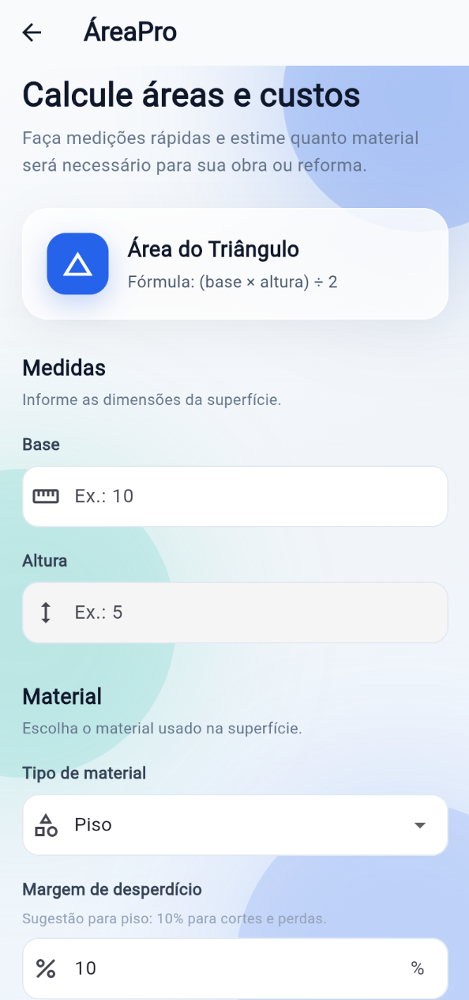
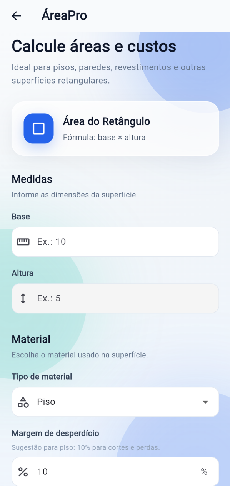
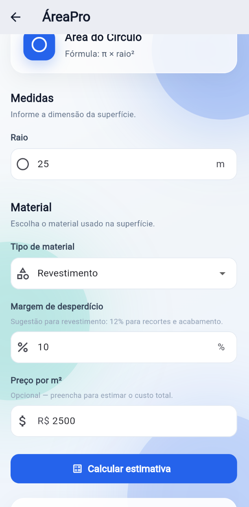
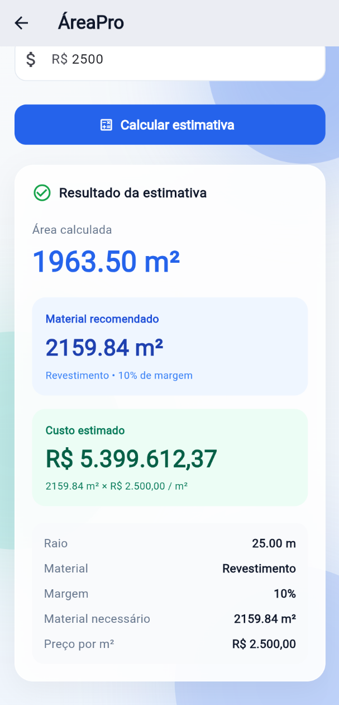

# ÁreaPro

<p align="center">
  <strong>Smart measurements for construction and renovation planning.</strong>
</p>

<p align="center">
  ÁreaPro is a Flutter application that calculates surface areas, recommends material waste margins, estimates material requirements, and projects total costs.
</p>

<p align="center">
  
  
  
  
  
</p>

---

## Overview

**ÁreaPro** was built as a practical construction and renovation planning tool.

Instead of only calculating geometric formulas, the application connects measurements with real-world material and cost estimation.

The user can:

- calculate surface areas;
- select a material type;
- receive a suggested waste margin;
- manually adjust the waste percentage;
- calculate the recommended amount of material;
- estimate the total cost based on price per square meter.

---

## Screenshots

### Home

<p align="center">
  
</p>

### Area Calculators

<p align="center">
  
  &nbsp;&nbsp;
  
</p>

### Calculation Flow

<p align="center">
  
  &nbsp;&nbsp;
  
</p>

---

## Features

### Geometry Calculators

ÁreaPro currently supports:

- Triangle area calculation
- Rectangle area calculation
- Circle area calculation

### Material Estimation

The app calculates the recommended material quantity by adding a configurable waste margin to the calculated area.

### Material-Based Waste Suggestions

The selected material automatically provides a suggested waste percentage:

| Material | Suggested Waste |
| --- | ---: |
| Flooring | 10% |
| Wall covering | 12% |
| Paint | 5% |
| Wood | 15% |
| Custom | User-defined |

The percentage can still be manually edited by the user.

### Cost Estimation

When a price per square meter is provided, ÁreaPro calculates the estimated project cost based on the final material requirement.

---

## Business Case

Construction and renovation measurements often involve more than calculating an area.

A user may know that a floor measures **50 m²**, but still needs to answer:

- How much material should actually be purchased?
- How much extra material should be considered for cuts and waste?
- What will the material cost?
- How can different surface formats be calculated quickly?

ÁreaPro combines these calculations into a single workflow.

### Example

For a rectangular surface:

```text
Base: 10 m
Height: 5 m
Material: Flooring
Waste margin: 10%
Price: R$ 85.00 / m²
```

ÁreaPro returns:

```text
Calculated area: 50.00 m²
Recommended material: 55.00 m²
Estimated cost: R$ 4,675.00
```

---

## User Flow

```text
Choose a geometric shape
        ↓
Enter measurements
        ↓
Select material
        ↓
Review suggested waste margin
        ↓
Enter price per m² (optional)
        ↓
Calculate
        ↓
Area + Material Requirement + Estimated Cost
```

---

## Tech Stack

- **Flutter**
- **Dart**
- **Material 3**

The interface uses a custom visual identity with:

- responsive layouts;
- gradient backgrounds;
- glass-inspired cards;
- reusable form components;
- input validation;
- navigation between screens;
- modern Material 3 components.

---

## Project Structure

```text
lib/
├── main.dart
└── screens/
    ├── home_screen.dart
    ├── triangulo_screen.dart
    ├── retangulo_screen.dart
    └── circulo_screen.dart
```

### Responsibilities

#### `main.dart`

- application entry point;
- Material 3 configuration;
- global theme;
- app initialization.

#### `home_screen.dart`

- ÁreaPro presentation;
- calculator navigation;
- main product interface.

#### `triangulo_screen.dart`

- triangle area calculation;
- material selection;
- waste estimation;
- cost estimation.

#### `retangulo_screen.dart`

- rectangle area calculation;
- material selection;
- waste estimation;
- cost estimation.

#### `circulo_screen.dart`

- circle area calculation;
- material selection;
- waste estimation;
- cost estimation.

---

## Calculations

### Triangle

```text
Area = (base × height) / 2
```

### Rectangle

```text
Area = base × height
```

### Circle

```text
Area = π × radius²
```

### Material Requirement

```text
Recommended Material =
Area + (Area × Waste Percentage / 100)
```

### Cost Estimate

```text
Estimated Cost =
Recommended Material × Price per m²
```

---

## Getting Started

### Requirements

Make sure Flutter is installed and configured.

Check your environment:

```bash
flutter doctor
```

### Clone the repository

```bash
git clone https://github.com/mateusprogrid/area-pro.git
```

### Enter the project

```bash
cd area-pro
```

### Install dependencies

```bash
flutter pub get
```

### Run

```bash
flutter run
```

---

## Supported Platforms

The Flutter project includes support for:

- Android
- iOS
- Web
- Windows
- macOS
- Linux

Platform availability may depend on the local Flutter environment.

---

## Roadmap

Possible future improvements include:

- calculation history;
- saved renovation projects;
- material packaging estimation;
- quantity estimation by boxes, liters or units;
- exportable estimation reports;
- additional geometric shapes;
- localization in Portuguese and English;
- persistent storage;
- improved desktop layouts.

---

## Release

### v1.0.0

The first public release of ÁreaPro includes:

- triangle calculator;
- rectangle calculator;
- circle calculator;
- material selection;
- automatic waste suggestions;
- configurable waste percentages;
- material requirement calculation;
- cost estimation;
- responsive Material 3 interface;
- custom ÁreaPro visual identity.

---

## Author

**Mateus Melo**

Software Developer focused on software development, automation and artificial intelligence.

<p>
  <a href="https://github.com/mateusprogrid">
    GitHub
  </a>
</p>

---

## License

This project is licensed under the **MIT License**.

See the `LICENSE` file for details.

---

<p align="center">
  <strong>ÁreaPro</strong><br>
  From measurements to better estimates.
</p>